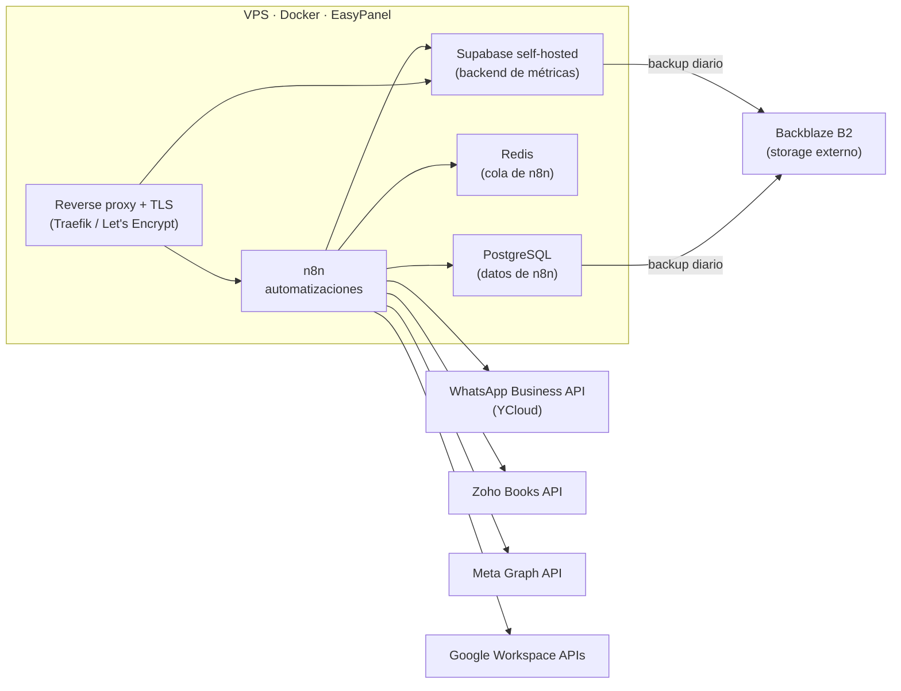

# Infraestructura de producción en un VPS

Administración de punta a punta de un servidor VPS en producción que hostea las automatizaciones, bases de datos e integraciones de una agencia de marketing. Opera con usuarios y tráfico reales de forma continua desde marzo de 2026, con un solo administrador.

| Dato | Valor |
|------|-------|
| En producción desde | marzo de 2026 |
| Uptime continuo | más de 100 días (a octubre de 2026) |
| Workflows de n8n activos | 18 |
| Recursos | 4 vCPU, 8 GB RAM, 145 GB de disco (~40% en uso) |
| Sistema operativo | Ubuntu 24.04 LTS |

## Arquitectura

## Stack

| Categoría | Tecnología | Rol |
|-----------|------------|-----|
| Sistema operativo | Ubuntu 24.04 LTS | Base del servidor |
| Contenedores | Docker | Aislamiento y despliegue de cada servicio |
| Orquestación | EasyPanel | Despliegues, dominios y reverse proxy |
| Reverse proxy + TLS | Traefik + Let's Encrypt | HTTPS y certificados automáticos |
| Automatización | n8n (self-hosted) | Integraciones y lógica de negocio |
| Bases de datos | PostgreSQL, Supabase | Datos de n8n y backend de aplicaciones |
| Cola | Redis | Ejecuciones de n8n |
| Mensajería | WhatsApp Business API (YCloud) | Canal oficial de WhatsApp |
| Backups | rclone + Backblaze B2 | Respaldo externo |

## Qué corre en el servidor

- [Generación automática de remitos](https://github.com/rami-fresia/automatizacion-remitos) en Zoho Books (~29 por mes).
- [Cobranza automática por WhatsApp](https://github.com/rami-fresia/automatizacion-cobranzas-whatsapp) (~115 mensajes por mes).
- [Plataforma de métricas de Instagram](https://github.com/rami-fresia/instagram-metrics) (24 cuentas sincronizadas a diario).
- Envío mensual de informes de métricas por WhatsApp.

En conjunto, estas automatizaciones liberan unas 6 horas por mes de trabajo administrativo.

## Backups

| Qué | Frecuencia | Destino |
|-----|-----------|---------|
| PostgreSQL de n8n (workflows, credenciales, historial) | Diario, 02:00 | Backblaze B2 |
| Supabase de métricas (`pg_dumpall`) | Diario, 03:00 | Disco local (7 días) + Backblaze B2 |
| Base del CRM comercial (export JSON/CSV) | Diario, 04:30 y 05:00 | Disco local + Backblaze B2 |

- **Fuera del servidor:** el destino es un proveedor distinto del hosting, así un respaldo sobrevive a la pérdida total del VPS.
- **Verificación:** el script valida que el dump esté completo antes de subirlo, y la subida se controla con `rclone check`.
- **Mínimo privilegio:** las credenciales de backup solo tienen acceso a un bucket privado.
- **Restore probado** para la base del CRM.

## Seguridad

Implementado:

- TLS en todos los servicios expuestos.
- Firewall UFW activo.
- Backups externos en un bucket privado con credenciales restringidas.
- 2FA en el panel del proveedor de hosting.
- Credenciales centralizadas en un gestor de contraseñas; nunca en repositorios.
- Supabase con secreto JWT propio rotado y Row Level Security en todas las tablas (ver [instagram-metrics](https://github.com/rami-fresia/instagram-metrics)).
- Error Workflows que avisan por mail, independientes del canal de WhatsApp.

En curso:

- Hardening de SSH: autenticación solo por clave y sin login de root.
- fail2ban contra fuerza bruta.
- Auditoría periódica con Lynis.
- Monitoreo de disponibilidad externo con alertas.

## Incidentes resueltos

- **Caída total por presión de memoria:** diagnóstico del consumo por contenedor y restauración del servicio.
- **Fallos recurrentes de DNS:** identificación de la causa y corrección.
- **Número de WhatsApp restringido:** la integración no oficial (Evolution API) disparó una restricción por mensajería masiva. Diagnóstico con el estado real de entrega de cada mensaje y migración a la API oficial con plantillas aprobadas por Meta. Detalle en [automatizacion-cobranzas-whatsapp](https://github.com/rami-fresia/automatizacion-cobranzas-whatsapp).

## Mantenimiento

- Limpieza programada de logs de Docker cada 6 horas para que no llenen el disco.
- Monitoreo de CPU, memoria, disco y red desde EasyPanel.
- Revisión periódica del estado de los workflows y de las ejecuciones fallidas.

## Decisiones técnicas

- **Self-hosted en lugar de SaaS:** un VPS de costo fijo sale bastante menos que n8n Cloud, que cobra por volumen de ejecuciones, y da control total sobre los datos.
- **EasyPanel en lugar de Docker Compose a mano:** despliegues desde plantillas, SSL y dominios automáticos, menos configuración que mantener para un solo administrador.
- **API oficial de WhatsApp en lugar de integraciones no oficiales:** estabilidad y cumplimiento de las políticas de Meta, a cambio de un costo por mensaje bajo (~USD 4 por mes).
- **Backups en otro proveedor:** un backup en el mismo servidor no protege contra la pérdida del servidor.

## Sobre este repositorio

Documenta infraestructura real con fines de portfolio. No contiene IPs, dominios, puertos, credenciales ni datos de clientes.
