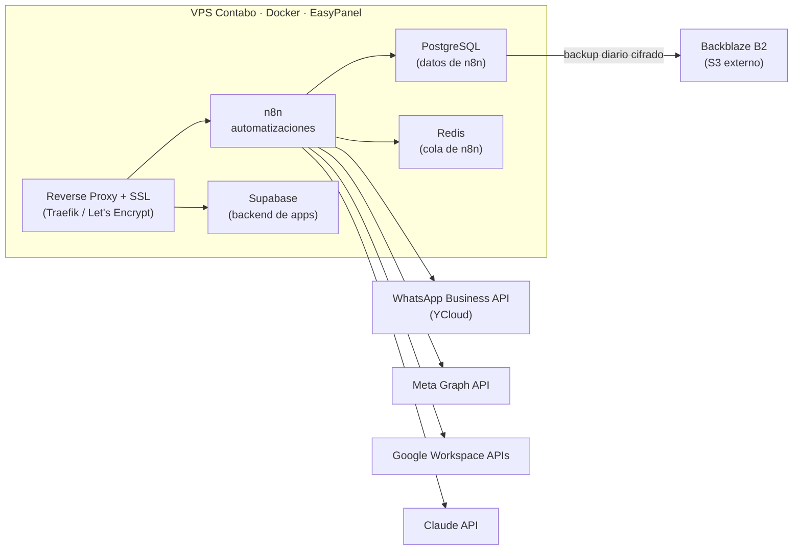

# Infraestructura de Producción — VPS de Automatizaciones y Servicios

Administración autogestionada de un servidor VPS en producción que hostea las
automatizaciones, integraciones y servicios de mensajería de una agencia de
marketing. El servidor opera con usuarios y tráfico reales de forma continua
desde marzo de 2026.

> **Rol:** administración, configuración, orquestación y mantenimiento del
> servidor, los contenedores y los servicios que corren sobre él. Un solo
> administrador.

<!--
NOTA DE OPSEC / PRIVACIDAD (borrá este comentario antes de publicar):
- NO pongas la IP real del servidor, ni el dominio real del cliente, ni puertos exactos.
- NO subas credenciales, tokens, .env, ni capturas con datos sensibles.
- Si mostrás capturas, tapá IPs, dominios de clientes y nombres de usuarios reales.
- Podés reemplazar "una agencia de marketing" por el nombre real si querés.
Documentar bien SIN filtrar nada ya es, en sí mismo, una señal de que sabés lo que hacés.
-->

---

## Resumen

Administro de punta a punta un VPS en producción: sistema operativo, contenedores,
seguridad, backups y mantenimiento. Sobre él corren flujos de automatización, bases
de datos e integraciones con APIs externas que dan servicio real a una agencia de
marketing.

- **Estado:** en producción continua desde **marzo de 2026** (+5 meses)
- **Gestión:** un solo administrador
- **Recursos:** 4 núcleos de CPU · 8 GB RAM · ~145 GB de disco (38% en uso, ~91 GB
  libres), con utilización holgada
- **Uptime:** +68 días de operación continua sin interrupciones (a la fecha de esta doc)

---

## Arquitectura

---

## Stack tecnológico

| Categoría               | Tecnología                                   | Rol                                              |
|-------------------------|----------------------------------------------|--------------------------------------------------|
| Hosting                 | Contabo VPS                                  | Servidor en la nube                              |
| Sistema operativo       | Ubuntu 24.04 LTS (Noble Numbat)              | Base del servidor                                |
| Contenedores            | Docker                                       | Aislamiento y despliegue de cada servicio        |
| Panel / orquestación    | EasyPanel                                    | Gestión de contenedores, despliegues y dominios  |
| Reverse proxy + SSL     | Traefik + Let's Encrypt (vía EasyPanel)      | Enrutado HTTPS y certificados automáticos        |
| Automatización          | n8n (self-hosted)                            | Flujos de integración y lógica de negocio        |
| Base de datos           | PostgreSQL                                   | Persistencia de datos de n8n                     |
| Cola / cache            | Redis                                        | Procesamiento de ejecuciones de n8n              |
| Backend de aplicaciones | Supabase                                     | Base de datos, auth y storage para apps          |
| Mensajería              | WhatsApp Business API (YCloud)               | Canal oficial de WhatsApp                        |
| Integraciones externas  | Meta Graph API · Google Workspace · Claude API | Servicios consumidos por los flujos            |
| Almacenamiento backups  | Backblaze B2 (S3-compatible)                 | Respaldo externo de la base de datos             |

---

## Servicios y automatizaciones en producción

Flujos de **n8n** activos:

- **Recopilación de métricas** de redes sociales de clientes.
- **Generación automática de recibos/remitos.**
- **Envío de reportes e informes de métricas por WhatsApp.**
- **Notificaciones/mensajería por WhatsApp** — migrado a la API oficial (ver
  *Decisiones técnicas*); primeros envíos automáticos programados para esta semana.

Servicios de soporte: **PostgreSQL** (almacena los workflows, credenciales e
historial de ejecuciones de n8n) y **Redis** (cola de ejecuciones). **Supabase**
provee el backend de aplicaciones: el servidor corre **3 proyectos Supabase
independientes** (métricas de Instagram de clientes, CRM de prospectos y
agenda/turnos), cada uno con su propia base de datos, autenticación y storage.

---

## Backups

Respaldo automático de la base de datos configurado y en operación:

- **Qué se respalda:** base de datos PostgreSQL (contiene todos los workflows,
  credenciales e historial de n8n).
- **Frecuencia:** diaria y automatizada (cron `0 2 * * *`, 02:00 hs).
- **Destino:** almacenamiento externo S3 (**Backblaze B2**), **fuera del servidor** —
  sobrevive a una falla total del VPS.
- **Cifrado:** en reposo (Server-Side Encryption).
- **Retención:** 14 días (rotación automática de respaldos viejos).
- **Control de acceso:** credenciales de aplicación **restringidas al bucket**
  (principio de mínimo privilegio); bucket privado.
- **Prueba de restauración:** `[COMPLETAR: pendiente — probar un restore end-to-end]`

Respaldo de Supabase (bases de datos de aplicaciones):

- **Alcance:** el servidor hostea **3 proyectos Supabase independientes** (métricas de
  Instagram, CRM de prospectos y agenda/turnos), cada uno con su propia base de datos.
- **Método:** export con `pg_dumpall` desde cada contenedor de base de datos y subida a
  Backblaze B2 mediante **rclone**, con verificación del tamaño del dump y listado de
  confirmación de la subida.
- **Estado:** respaldo **manual** de las **3 bases** realizado y verificado. Automatización
  de este flujo pendiente (roadmap).

---

## Seguridad

Medidas implementadas:

- **TLS/SSL** en todos los servicios expuestos (Let's Encrypt vía Traefik).
- **Backups cifrados** en reposo y almacenados fuera del servidor.
- **Mínimo privilegio** en las credenciales de backup (acceso limitado a un solo bucket).
- **2FA** habilitado en el panel de hosting (Contabo), con código de recuperación resguardado.
- **Gestión de credenciales** centralizada en un gestor de contraseñas.
- **Respaldos por línea de comandos** (`pg_dumpall` + `rclone` hacia S3) además de los
  automáticos vía panel.

Roadmap de hardening (en implementación):

- Endurecimiento del acceso SSH (autenticación por clave, deshabilitar login de root,
  cambio de puerto por defecto).
- Firewall (UFW) y bloqueo de fuerza bruta (fail2ban).
- Auditoría periódica con **Lynis** y análisis de logs de intentos de acceso.

> 🔗 Análisis de logs de ataques SSH reales y hardening de este servidor:
> `[COMPLETAR: link al repo del proyecto de seguridad cuando lo tengas]`

---

## Monitoreo y mantenimiento

- **Monitoreo de recursos:** métricas de CPU, memoria, disco y red vía EasyPanel.
- **Monitoreo de disponibilidad:** `[COMPLETAR: ej. Uptime Kuma — planificado]`
- **Mantenimiento rutinario:** revisión de estado de servicios, uso de disco y
  actualizaciones de contenedores. `[COMPLETAR: ajustá según tu rutina real]`

---

## Decisiones técnicas

*El "por qué" detrás del setup — completá/ajustá con tus propias razones.*

- **Migración de WhatsApp a la API oficial:** inicialmente la mensajería corría sobre
  **Evolution API** (solución no oficial). Meta detectó el patrón de envíos automáticos
  y restringió el número. Migré el canal a la **API oficial de WhatsApp Business
  mediante YCloud (BSP)**, con coexistencia y plantillas aprobadas por Meta, para tener
  un canal estable y dentro de las políticas de la plataforma.
- **Self-hosted sobre SaaS:** un VPS con costo fijo mensual resultó considerablemente
  más económico que n8n Cloud, cuyo precio escala con el volumen de ejecuciones. Con
  self-hosting el costo es previsible y no crece con el uso, además de dar control total
  sobre los datos y sin límites de ejecuciones.
- **EasyPanel sobre Docker Compose manual:** EasyPanel permite desplegar y gestionar
  los servicios de forma visual (despliegue desde plantillas, manejo automático de SSL,
  dominios y reverse proxy) sin necesidad de escribir y mantener archivos de
  configuración a mano, lo que agiliza la administración del servidor.
- **Backups a un proveedor externo y no en el mismo server:** un respaldo local no
  protege ante la pérdida total del VPS; por eso el destino es un storage externo
  independiente del hosting.

---

## Sobre este repositorio

Este README documenta infraestructura real en producción con fines de portfolio.
No contiene IPs, dominios de clientes, credenciales ni datos sensibles.

**Contacto:** [github.com/rami-fresia](https://github.com/rami-fresia/Ramiro-Fresia)
